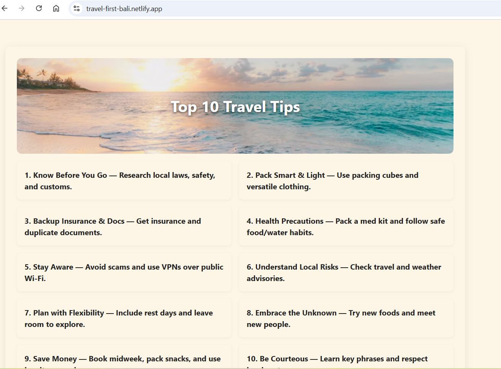

# 🌍 Travel First

A beautifully designed travel essentials and safety guide built with React + Vite. Plan smarter, pack lighter, and travel with peace of mind.

🔗 **Live Site**: [travel-first-bali.netlify.app](https://travel-first-bali.netlify.app/)



---

## ✨ Features

- ✅ Top 10 essential travel tips — clickable and clean UI
- ✅ Curated list of must-have travel items with helpful links
- ✅ Live weather lookup by destination (OpenWeather API)
- ✅ Toggle between Light/Dark Mode
- ✅ Mobile responsive and visually engaging
- ✅ Custom design with themed travel images

---

## 📦 Tech Stack

- **React** with Vite
- **CSS Modules** for styling
- **OpenWeatherMap API**
- **Netlify** for deployment

---

## 📸 How to Add a Screenshot

The image shown above is saved locally at:
📁 public/assets/travel-screenshot.png

yaml
Copy
Edit

If you're replacing it, simply overwrite that file or change the path in the markdown.

---

## 🚀 Getting Started

```bash
git clone https://github.com/kmazza-hub/travel-first.git
cd travel-first
npm install
npm run dev
🔐 Environment Variables
Create a .env file in the root directory:

env
Copy
Edit
VITE_WEATHER_API_KEY=your_openweather_api_key
🧑‍💻 Author
Keith Mazza
GitHub | LinkedIn

©️ License
MIT License. © 2025 Keith Mazza

yaml
Copy
Edit
